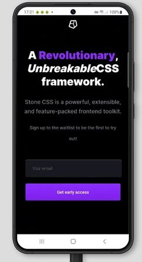
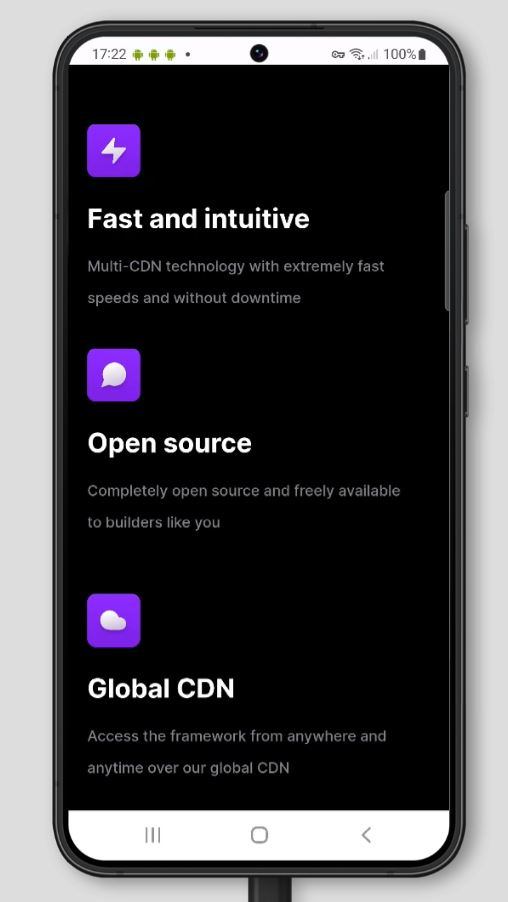

# Stone CSS Android App

**Made with ❤ By DVS Tech Labs**

v1.0.0

Android App For Stone CSS. Docs will be soon available followed with release.

You can find the repository for Stone CSS Framework at <a href="https://github.com/devarshishimpi/Stone-CSS-Framework" target="_blank">Github</a>

Please give this repo a ⭐ it really helps us!

## Contributing

Contributions are always welcome!

See `contributing.md` for ways to get started.

Please adhere to this project's `Code of Conduct`.

## Downloads

* <a href="https://github.com/devarshishimpi/Stone-CSS-Android/releases" target="_blank">Github Releases Page</a>
* DVS App Store
* <a href="https://assets.stonecss.com/androidapps" target="_blank">Stone CSS Website</a>
## Screenshots

 | 
## Feedback

If you have any feedback, please reach out to us at devarshishimpi@gmail.com

## Support

If you would like to support me, you can support on any of the below platforms.

